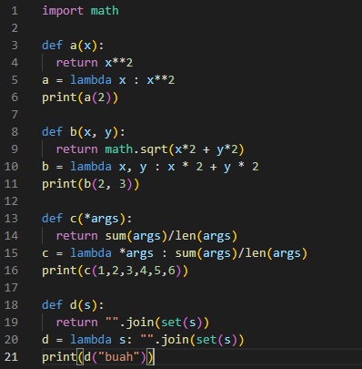
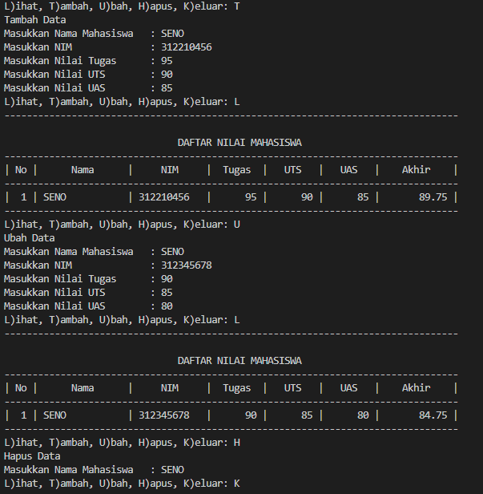

# PRAKTIKUM 7

## Mengubah Code Lambda

## DAFTAR NILAI MENGGUNAKAN FUNGSI

Fungsi - Tambah () untuk menambah data
Fungsi - Tampilkan () untuk menampilkan data
Fungsi - Hapus () untuk menghapus data berdasarkan nama
Fungsi - Ubah () untuk mengubah data berdasarkan nama
LIHAT CODE DIBAWAH INI !!!

